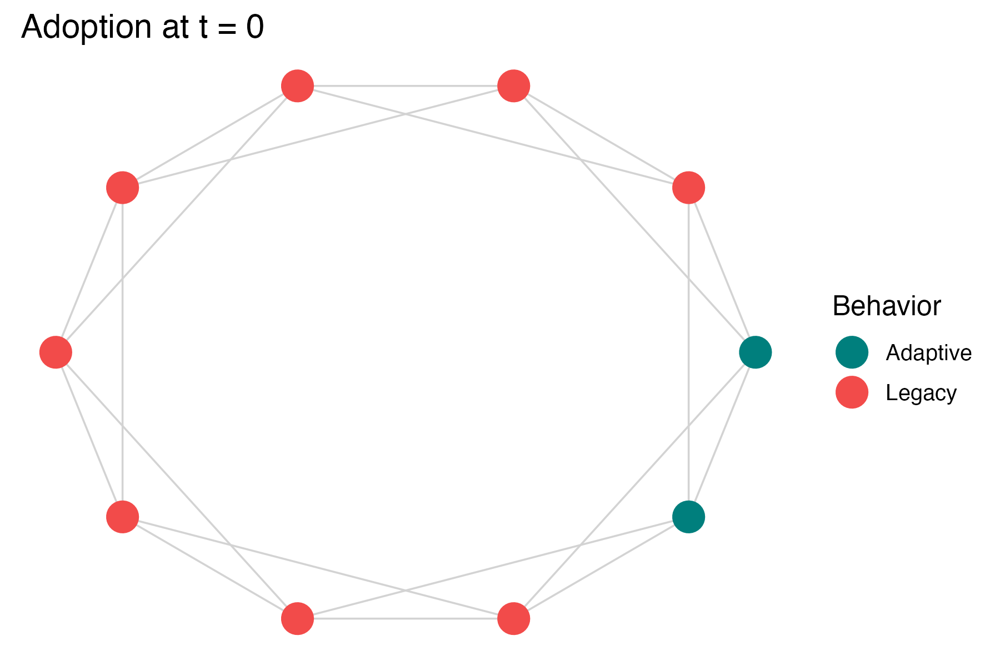

# socmod <a href="https://css4s.github.io/socmod/"></a>

<!-- README.md is generated from README.Rmd. Please edit that file -->

# Introduction

The goal of `socmod` is to simplify development of models of social
behavior for beginners and experts alike. The current focus is
agent-based models of adaptive behavior diffusion. The framework is
designed to be extensible to other contexts in social behavior modeling
and beyond.

## Quickstart examples

Below we present two examples of how `socmod` can be used for succinctly
defining models of social behavior.

1.  Initialize and run, then visualize adaptation diffusion over time
    for a single simulation trial
2.  Set up and run a computational experiment of simulated *adaptation
    success* (i.e., fixation of adaptive behavior) and time to fixation
    for different adaptive fitness values when agents learn using
    success-biased partner selection

### Prereq: load required libraries.

``` r
library(ggnetwork)
library(igraph)
library(magrittr) # Loads %>%
library(socmod)
library(purrr)
```

### Example 1: single model trial and visualization

``` r
# Create an example agent-based model with success-biased learning...
abm <- 
  make_abm(graph = make_regular_lattice(10, 4)) %>%
  # Initialize 20% (2) agents with Adaptive behavior w/ 
  # adaptive fitness 1.125x the non-adaptive Legacy behavior
  initialize_agents(initial_prevalence = 0.2, adaptive_fitness = 1.125)

# Inspect the initialization to ensure 2 agents do Adaptive
p <- plot_network_adoption(
  abm, layout = igraph::in_circle(), 
  plot_mod = \(p) p + ggtitle("Adoption at t = 0"), edgewidth = 0.75
)
```



``` r
# Run and visualize a single trial, add title with f_A
p_prevalence <- 
  make_abm(graph = make_regular_lattice(10, 4)) %>%
  initialize_agents(initial_prevalence = 0.2, adaptive_fitness = 1.125) %>%
  run_trial %>%
  plot_prevalence(tracked_behaviors = c("Adaptive")) %>% 
  { . + ggplot2::ggtitle("Adaptive fitness = 1.125") }
```


### Example 2: computational experiment over adaptive fitness

Computational experiments can be created in a similar declarative style,
beginning with a user-defined model generation function:

``` r
# Model generator
abm_gen <- function(params) {
  do.call(make_abm, params) %>%
    initialize_agents(
      initial_prevalence = params$initial_prevalence,
      adaptive_fitness = params$adaptive_fitness
    )
}
```

This can then be used to create new model instances across input
parameter values specified when the user calls `run_trials` to run
trials for all parameter combinations, and a user-specified number of
trials per parameter setting. Below we first run a smaller set of trials
to compare the dynamics of a few adaptive fitness values near 1.0, i.e.,
under *neutral selection* in cultural evolutionary terms (Example 2A).
We then calculate success rate over several trials for a series of
adaptive fitness values (Example 2B).

#### Example 2A: Prevalence dynamics across trials and adaptive fitnesses

``` r
# Run five trials per parameter setting, i.e., for each specified adaptive_fitness
adaptive_fitness_vals <- c(0.9, 1.1, 1.4)
trials <-
  run_trials(
    abm_gen,
    n_trials_per_param = 5,
    stop = socmod::fixated,
    n_agents = 20,
    initial_prevalence = 0.1,
    adaptive_fitness = adaptive_fitness_vals
  )
# Summarize within trials only; rename and factor adaptive fitness for display
summary <- summarise_prevalence(
  trials, input_parameters = "adaptive_fitness", across_trials = F
) %>% 
  dplyr::mutate(
    `Adaptive fitness` = factor(adaptive_fitness, adaptive_fitness_vals)
  )

p <- ggplot(
  summary,
  aes(x=Step, y=Prevalence,
      color=`Adaptive fitness`,
      linetype=`Adaptive fitness`,
      group = trial_id)) +
  geom_line(linewidth=1.4, alpha = 0.875) + theme_classic(base_size = 16) +
  ggplot2::scale_color_manual(values = unname(SOCMOD_PALETTE))
```


#### Example 2B: success rate and average fixation time across adaptive fitness

In this example we analyze 20 trials per adaptive fitness value (8
total) with 100 agents. This means 160 trials total. This takes about
six minutes.

``` r
# Run five trials per parameter setting, i.e., for each specified adaptive_fitness
adaptive_fitness_vals <- c(0.8, 0.9, 1.0, 1.1, 1.2, 1.3, 1.4, 1.5)
trials <-
  run_trials(
    abm_gen_fA_experiment,
    n_trials_per_param = 20,
    stop = socmod::fixated,
    syncfile = "man/build/readme-demo-cpu-experiment.RData",
    n_agents = 100,
    .progress = T,
    # overwrite = T,
    initial_prevalence = 0.1,
    adaptive_fitness = adaptive_fitness_vals
  )
```

Let’s confirm we have 160 trials:

``` r
length(trials) == 160 
#> TRUE
```

Now calculate custom summary of the outcomes over adaptive fitness
values:

``` r
outcomes <- summarise_outcomes(
  trials, 
  input_parameters = "adaptive_fitness", 
  outcome_measures = c("success_rate", "mean_fixation_steps")
) 

max_fix_time <- max(outcomes$Value[outcomes$Measure == "mean_fixation_steps"])
# Normalize to calculate mean fixation time as a fraction of maximum
outcomes_norm <- outcomes %>%
  dplyr::mutate(Value = dplyr::case_when(
    Measure == "mean_fixation_steps" ~ Value / max_fix_time,
    TRUE ~ Value
  ))
# Rename and set order of Measure factors to avoid messing with the legend in plotting
outcomes_norm$Measure[outcomes_norm$Measure == "success_rate"] <- "Success rate"
outcomes_norm$Measure[outcomes_norm$Measure == "mean_fixation_steps"] <- "Normalized fixation time"
outcomes_norm$Measure <- factor(outcomes_norm$Measure, levels = c(
  "Success rate", "Normalized fixation time"
))

# Use a custom socmod line color
line_color <- SOCMOD_PALETTE_CVD["pink"]
outcomes_norm %>%
  ggplot2::ggplot(aes(x = adaptive_fitness, y = Value, linetype = Measure)) +
  geom_line(color = line_color, linewidth=1.5) + 
  scale_x_continuous(breaks = adaptive_fitness_vals) +
  theme_classic(base_size = 16) + xlab("Adaptive fitness") + ylab("Value")
```


### Installation

You can install the development version of socmod from
[GitHub](https://github.com/) with `devtools` or `pak`:

**devtools**

``` r
# Install this if you don't have devtools.
install.packages("devtools")
devtools::install_github("css4s/socmod")
```

**pak**

``` r
# Install this if you don't have pak.
install.packages("pak")
pak::pak("css4s/socmod")
```
