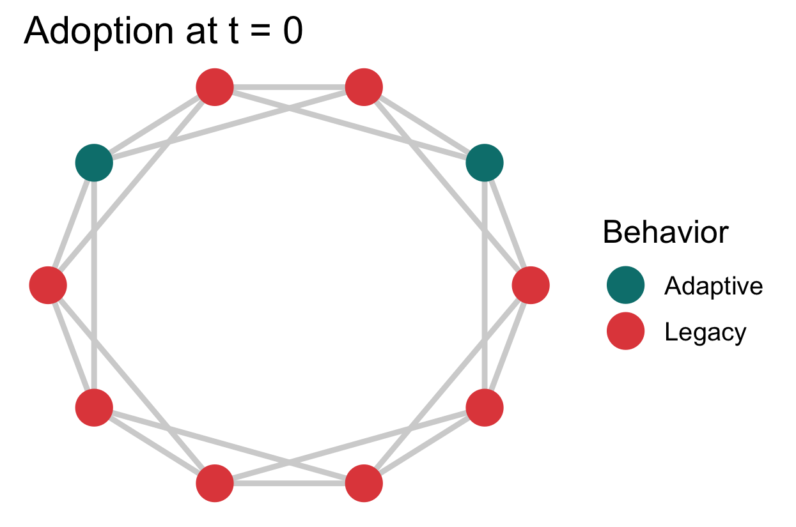
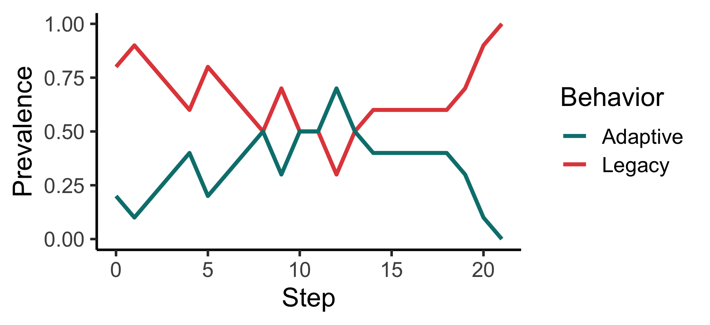

<!-- README.md is generated from README.Rmd. Please edit that file -->

# Introduction

The goal of `socmod` is to simplify development of models of social
behavior for beginners and experts alike, currently focusing on
agent-based models of adaptation diffusion. The framework is general,
though, and the software could be extended to other social behavior
models.

## Quickstart examples

Below we present two examples of how `socmod` can be used for succinctly
defining models of social behavior.

1.  Initialize and run, then visualize adaptation prevalence over time
    for a single model paramterization
2.  Set up and run a computational experiment to probe how adaptation
    prevalence dynamics and intervention success depend on the adaptive
    fitness assuming agents use success-biased learning.

Prereq: load libraries.

``` r
library(ggnetwork)
library(igraph)
library(magrittr) # Loads %>%
library(socmod)
```

### Example 1: single model trial and visualization

``` r
make_abm(n_agents = 100) %>%
  # Initialize 10% w/ Adaptive: fitness 12.5% greater than Legacy
  initialize_agents(
    initial_prevalence = 0.1, 
    adaptive_fitness = 1.125
  ) %T>% (\(m) plot_network_adoption(m) %>% print()) %>%
  run_trial %>%
  plot_prevalence %>%
  print
```



``` r

df <- plot_network_adoption(make_abm(n_agents = 10))
```

### Example 2: computational experiment over adaptive fitness

Success-biased learning is the default, so we do not need to specify the
learning strategy. We can just define the model generating function to
initialize a certain fraction with the adaptive behavior and vary the
adaptive fitness, the main outcome variable of this analysis. Note the
functional style: we pass two functions as arguments to `run_trials`:
`abm_gen_fA_experiment` and `socmod::fixated`.

``` r
# Model generating function
abm_gen_fA_experiment <- function(parameter_list) {
  # Initialize ABM with given parameters.
  abm <- do.call(make_abm, parameter_list)
  # Store parameter list w/ fewer characters
  pl <- parameter_list
  # Return the model with agents initialized as specified
  return (
    abm %>% 
      initialize_agents(
        initial_prevalence = pl$initial_prevalence,
        adaptive_fitness = pl$adaptive_fitness
      )
  )
}
```

Now pass this function to run_trials:

``` r
# Run five trials per parameter setting, i.e., for each specified adaptive_fitness
adaptive_fitness_vals <- c(0.6, 0.8, 1.0, 1.2, 1.4, 1.6, 1.8, 2.0)
trials <- 
  run_trials(
    abm_gen_fA_experiment, 
    n_trials_per_param = 5,
    stop = socmod::fixated,
    n_agents = 20,
    initial_prevalence = 0.1,
    adaptive_fitness = adaptive_fitness_vals
  )
```

Now we have a total of 40 trials: 8 adaptive fitness values times five
trials per setting:

``` r
length(trials) == 40
#> [1] TRUE
```

Let’s take out only a couple values of adaptive fitness, 0.8 and 1.4,
and plot the mean prevalence time series for each:

``` r
t_series_summaries <- 
  summarise_prevalence(trials, across_trials = FALSE)

filter_grp_lim <- 
  t_series_summaries %>% 
  dplyr::mutate(
    adaptive_fitness = factor(adaptive_fitness, adaptive_fitness_vals)
  ) %>% 
  dplyr::filter(adaptive_fitness %in% c(0.8, 1.4)) %>% 
  dplyr::mutate() %>% 
  dplyr::group_by(Step, Behavior, adaptive_fitness)
```

### Installation

You can install the development version of socmod from
[GitHub](https://github.com/) with `devtools` or `pak`:

**devtools**

``` r
# Install this if you don't have devtools.
install.packages("devtools")
devtools::install_github("css4s/socmod")
```

**pak**

``` r
# Install this if you don't have pak.
install.packages("pak")
pak::pak("css4s/socmod")
```

## More information and the philosophy of socmod

Different models of social behavior are specified by the details of how
many individuals are in a population, what behaviors or opinions they do
or have, what benefits they accrue(d) through their behaviors, how they
learn or influence one another, and any environmental or other relevant
factors. This framework seeks to encapsulate different approaches to
modeling diverse social behaviors, such as those thoroughly reviewed in
Paul Smaldino’s (2023) textbook [*Modeling Social
Behavior*](https://press.princeton.edu/books/paperback/9780691224145/modeling-social-behavior?srsltid=AfmBOop2zNSsOtNlOMs6uaLTlAQs8saVMC_I6y_OnyklIKz-GUnoNapR).

Technically, `socmod` uses object-oriented programming, provided by
[`R6`](https://r6.r-lib.org/), and functional-style agent and model
behavior specification inspired by
[Agents.jl](https://juliadynamics.github.io/Agents.jl/stable/), which I
myself have enjoyed using. But, I still had to do my plotting in R, and
more beginning students across disciplines will tend to know R than
Julia. R also seems to have a great community with the `r-lib` project
that seems to be bringing a continuity to scientific programming that I
have not seen in any other programming language.
