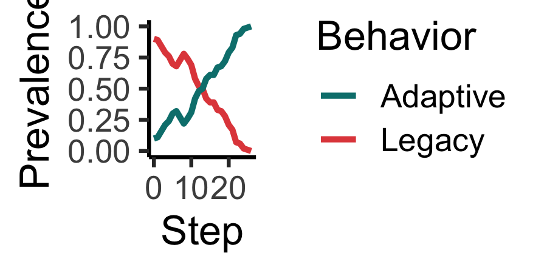

<!-- README.md is generated from README.Rmd. Please edit that file -->

# Introduction

The goal of `socmod` is to simplify development of models of social
behavior for beginners and experts alike, currently focusing on
agent-based models of adaptation diffusion. The framework is general,
though, and the software could be extended to other social behavior
models.

## Quickstart examples

Below we present two examples of how `socmod` can be used for succinctly
defining models of social behavior. In the first example we initialize
and run, then visualize adaptation prevalence over time, with a single
model initalized with a single set of model parameters. In the second
example we set up a computational experiment to analyze how simulated
prevalence dynamics and intervention success rate depend on the adaptive
fitness when agents learn via success-biased social learning.

``` r
make_abm(n_agents = 100) %>%
  # Initialize 20% of agents w/ Adaptive w/ fitness 0.125 times > than Legacy
  initialize_agents(initial_prevalence = 0.1, adaptive_fitness = 1.125) %>%
  run_trial %>%
  plot_prevalence %>%
  print
```



### Installation

You can install the development version of socmod from
[GitHub](https://github.com/) with `devtools` or `pak`:

**devtools**

``` r
# Install this if you don't have devtools.
install.packages("devtools")
devtools::install_github("css4s/socmod")
```

**pak**

``` r
# Install this if you don't have pak.
install.packages("pak")
pak::pak("css4s/socmod")
```

## More information and the philosophy of socmod

Different models of social behavior are specified by the details of how
many individuals are in a population, what behaviors or opinions they do
or have, what benefits they accrue(d) through their behaviors, how they
learn or influence one another, and any environmental or other relevant
factors. This framework seeks to encapsulate different approaches to
modeling diverse social behaviors, such as those thoroughly reviewed in
Paul Smaldino’s (2023) textbook [*Modeling Social
Behavior*](https://press.princeton.edu/books/paperback/9780691224145/modeling-social-behavior?srsltid=AfmBOop2zNSsOtNlOMs6uaLTlAQs8saVMC_I6y_OnyklIKz-GUnoNapR).

Technically, `socmod` uses object-oriented programming, provided by
[`R6`](https://r6.r-lib.org/), and functional-style agent and model
behavior specification inspired by
[Agents.jl](https://juliadynamics.github.io/Agents.jl/stable/), which I
myself have enjoyed using. But, I still had to do my plotting in R, and
more beginning students across disciplines will tend to know R than
Julia. R also seems to have a great community with the `r-lib` project
that seems to be bringing a continuity to scientific programming that I
have not seen in any other programming language.
