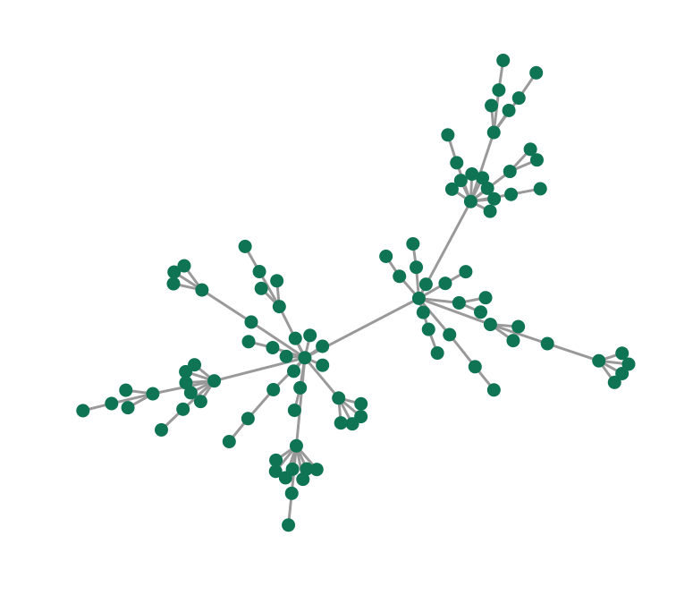

true

<!-- README.md is generated from README.Rmd. Please edit that file -->

# socmod

<!-- badges: start -->

[](https://app.codecov.io/gh/CSS4S/socmod)

<!-- badges: end -->

`socmod` provides a framework and utilities for developing simulations
of social learning and social influence structured by social networks.
It is being developed to support the course *Computational Social
Science for Sustainability* at the Stanford Doerr School of
Sustainability. The course teaches theory and techniques for
understanding cognitive and social mechanisms influencing beliefs and
behaviors that can be combined in computational models to predict the
relative efficacy of different candidate interventions for
sustainability, e.g., to promote ecological protection, public health,
economic security and justice, climate action, to name just a few
[sustainable development goals](https://sdgs.un.org/goals).

`socmod` is flexible to encapsulate any social process that can be
modeled as follows: (1) individuals are initialized with some knowledge
and payoff from behaviors they do or or beliefs they hold; (2) they
exchange information socially over time through teaching, observation,
discourse, etc. This process is illustrated in this figure:


Currently the focus of socmod is developing models of informational and
behavioral interventions to promote sustainable behaviors that we call
*adaptations*, $A$. Those not yet doing $A$ are said to be doing a
legacy behavior, $L$. Each agent can be assigned or gain fitness that is
tracked over time, which can be linked to whether they do $A$ or $L$.

`socmod` provides tools for initializing simulated individuals (i.e.,
*agents*), their social networks, and their behaviors. These
capabilities are introduced in a simple example below.

### Installation

You can install the development version of socmod from
[GitHub](https://github.com/) with `devtools` or `pak`:

**devtools**

``` r
# Install this if you don't have devtools.
# install.packages("devtools")
# devtools::install_github("CSS4S/socmod")
```

**pak**

``` r
# Install this if you don't have pak.
# install.packages("pak")
# pak::pak("CSS4S/socmod")
```

## Quickstart examples

To understand what socmod does to help organize and develop models of
social behavior, let’s consider a simple example with just four
individuals illustrated in the figure below. We will initialize our
agents with behaviors and payoffs as shown here, then explain how to use
different social learning strategies to simulate the diffusion of the
adaptation, $A$. $A$ yields a payoff of 2 while the legacy $L$ behavior
yields a payoff of 1. This matters only for the success-biased social
learning strategy, not for the frequency-biased strategy or unbiased
contagion learning.

<figure id="fig-example">

<figcaption aria-hidden="true">A simple network nieghborhood of
individual/agent <span
class="math inline"><em>i</em></span></figcaption>
</figure>

We can initialize these agents and their network as follows. In the next
code block we first initialize four agents named “i”, “n_i1”, “n_i2”,
and “n_i3” to match the illustration of focal/learner agent $i$ and its
three neighbors (each one is an *instance* of the `socmod::Agent`
class). Then we create the social network from the illustration using
`igraph`. Finally, we initialize a new `socmod::AgentBasedModel` using
the helper function `make_example_abm`. In the next subsection we then
use this helper function to initialize new models that will be run with
frequency- and success-biased adaptive learning strategies, using
learning functions provided with `socmod`. After that we show how to
define non-adaptive contagion learning functions, adapted from
compartmental epidemiological modeling.

``` r
library(socmod)

# Example ABM builder with four agents as pictured above. Can pass arbitrary
# named parameters in ... that will be passed to AgentBasedModel$new as params.
make_example_abm <- function(...) {
  
  n_agents <- 4
    
  agent_behaviors <- c("Legacy", "Legacy", "Legacy", "Adaptive")
  agent_fitness <- c(1, 1, 1, 2)
  agent_names <- c("i", "n_i1", "n_i2", "n_i3")
  
  make_example_agents <- function() {
  
    agents <- purrr::map(
      1:n_agents, \(a_idx) { 
        Agent$new(behavior=agent_behaviors[a_idx], 
                  fitness=agent_fitness[a_idx], 
                  name=agent_names[a_idx]) 
      }
    )
    
    return (agents)
  }
  
  agents <- make_example_agents()
  # Initialize network.
  socnet <- igraph::make_empty_graph(4, directed = FALSE)
  # Set the vertex names.
  igraph::V(socnet)$name <- agent_names
  
  # Edges can be added like so where every two names specify an edge.
  socnet <- igraph::add_edges(
    socnet, c("i", "n_i1", "i", "n_i2", "i", "n_i3", "n_i2", "n_i3")
  )
  
  # Create the agent-based model and plot the model's network.
  return (AgentBasedModel$new(agents = agents, network = socnet, ...))
}

abm <- make_example_abm()
plot(abm$network)
```


### Model dynamics with different adaptive social learning strategies

#### Frequency-biased adaptive learning

In frequency-biased transmission, the probability a learner adopts a
behavior is proportional to the number of network neighbors doing a
behavior. In the first time step, then, $n_{i2}$ has a 1/2 probability
of adopting $A$, and $i$ has a 1/3 probability of adopting $A$.

Here is how to set up an agent-based model and run it with
frequency-biased learning dynamics. There is a lot of stochasticity with
this setup, with many model runs ending with $A(t=50) = 4$, fixating on
the Adaptive behavior, and many ending with $A(t=50) = 0$, fixating on
the Legacy behavior.

``` r
library(ggplot2)
abm <- make_example_abm()

result <- run(abm, 50, frequency_bias_select_teacher, frequency_bias_interact, iterate_learning_model)

ggplot(result$output, aes(x=t, y=A)) + geom_line() + theme_classic()
```


We can check how many end in $A$ or $L$ being fixated like so, where
fixation on $A$ counts as adaptation “success”:

``` r
n_trials <- 100
one_trial_success <- function(n_steps = 50) {
  abm <- make_example_abm()
  A_T <- run(
    abm, n_steps, frequency_bias_select_teacher, 
    frequency_bias_interact, iterate_learning_model
  )$output$A[n_steps]
  
  return (ifelse(A_T == 4, 1, 0))
}

n_success <- sum(purrr::map_vec(1:n_trials, \(.) {one_trial_success()}));

success_rate <- n_success / n_trials
print(paste("Success rate:", success_rate))
#> [1] "Success rate: 0.24"
```

#### Success-biased adaptive learning

In success-biased transmission, the probability a learner adopts a
behavior is proportional to the relative fitness of their neighbors.
Note that in the simplest model of success-biased transmission, if there
is only one agent doing $A$, then this agent always adopts $L$ on the
first time step. This is the version currently provided by `socmod`.
Adding additional adaptive logic for making this evitable is left as an
exercise.

Here is how one can run a model with success-biased learning:

``` r
library(ggplot2)
abm <- make_example_abm()

result <- run(abm, 50, success_bias_select_teacher, success_bias_interact, iterate_learning_model)

ggplot(result$output, aes(x=t, y=A)) + geom_line() + theme_classic()
```


``` r
n_trials <- 100
one_trial_success <- function(n_steps = 50) {
  abm <- make_example_abm()
  A_T <- run(
    abm, n_steps, success_bias_select_teacher, 
    success_bias_interact, iterate_learning_model
  )$output$A[n_steps]
  
  return (ifelse(A_T == 4, 1, 0))
}

n_success <- sum(purrr::map_vec(1:n_trials, \(.) {one_trial_success()}));

success_rate <- n_success / n_trials
print(paste("Success rate:", success_rate))
#> [1] "Success rate: 0.65"
```

### Model dynamics with non-adaptive contagion learning

Now we show how to define custom learning functions using non-adaptive
contagion learning as an example. In contagion learning, a learner
adopts its interaction partner teacher’s behavior with probability
$\alpha$, called the *adoption rate*. We can also provide a *drop rate*
that represents the probability an individual stops doing the adaptive
behavior.

We can define contagion learning functions as follows, assuming that
partner selection is random.

``` r
contagion_partner_selection <- function(learner, model) {
  return (sample(learner$neighbors$agents, 1)[[1]])
}

contagion_interaction <- function(learner, teacher, model) {

  if ((learner$curr_behavior == "Legacy") && 
      (teacher$curr_behavior == "Adaptive") && 
      (runif(1) < model$params$adopt_rate)) { # this is how we implement prob learning w/ alpha
    learner$next_behavior <- "Adaptive"
    learner$next_fitness <- 2.0
  }
}

contagion_model_step <- function(model) {
  # If drop rate is non-zero, get a list of agents who will drop the behavior
  # if they are doing the Adaptive behavior.
  if (model$params$drop_rate > 0) {
    agent_drop <- runif(model$n_agents) < model$params$drop_rate
    
    for (agent in abm$agents[agent_drop]) {
      if (agent$curr_behavior == "Adaptive") {
        agent$next_behavior <- "Legacy"
        agent$next_fitness <- 1.0
      }
    }
  }
  
  # Basic learning step where the next behaviors and payoffs become current.
  iterate_learning_model(model)
}
```

Initialize a new agent-based model and run contagion learning dynamics:

``` r
library(ggplot2)
 
abm <- make_example_abm(adopt_rate = 0.2, drop_rate = 0.02)
result <- run(abm, 100, contagion_partner_selection, contagion_interaction,
              contagion_model_step)

ggplot(result$output, aes(x=t, y=A)) + geom_line() + theme_classic()
```



## More information and the philosophy of socmod

Different models of social behavior are specified by the details of how
many individuals are in a population, what behaviors or opinions they do
or have, what benefits they accrue(d) through their behaviors, how they
learn or influence one another, and any environmental or other relevant
factors. This framework seeks to encapsulate different approaches to
modeling diverse social behaviors, such as those thoroughly reviewed in
Paul Smaldino’s (2023) textbook [*Modeling Social
Behavior*](https://press.princeton.edu/books/paperback/9780691224145/modeling-social-behavior?srsltid=AfmBOop2zNSsOtNlOMs6uaLTlAQs8saVMC_I6y_OnyklIKz-GUnoNapR).

Technically, `socmod` uses object-oriented programming, provided by
[`R6`](https://r6.r-lib.org/), and functional-style agent and model
behavior specification inspired by
[Agents.jl](https://juliadynamics.github.io/Agents.jl/stable/), which I
myself have enjoyed using. But, I still had to do my plotting in R, and
more beginning students across disciplines will tend to know R than
Julia. R also seems to have a great community with the `r-lib` project
that seems to be bringing a continuity to scientific programming that I
have not seen in any other programming language.
